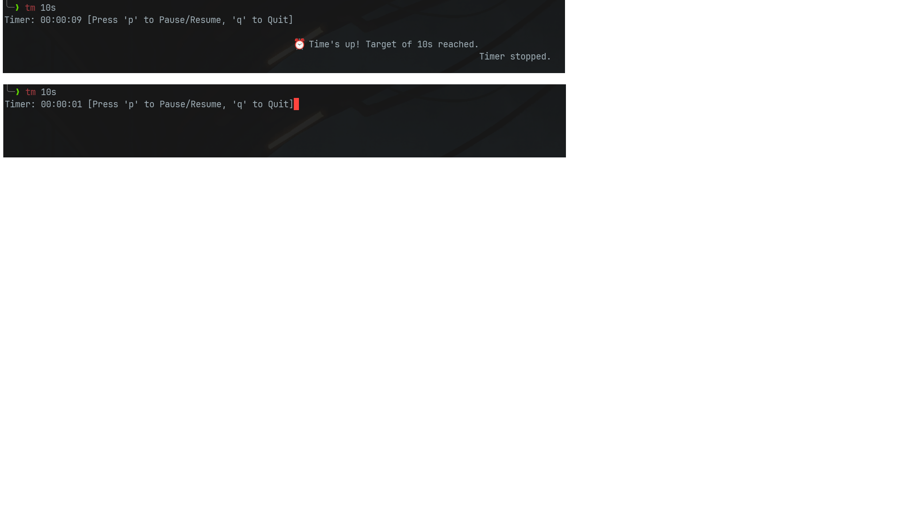

# In The Name of God

---

## ⏱ tm : Minimalistic Terminal-based timer.

### Features

- Run from terminal: `tm 10s`, `tm 25m`, `tm 1h30m`
- Press `p` to pause/resume
- Press `q` to quit early
- Supports human durations like `2h45m30s`
- Simple, no graphical BLOAT.

---

### Installation

```bash

sudo apt install pipx       #if not installed

pipx install tm-timer       #to install tm-timer

pipx ensurepath             #to add tm to PATH

exec $SHELL                 #to reset shell

```
---

tm preview:




